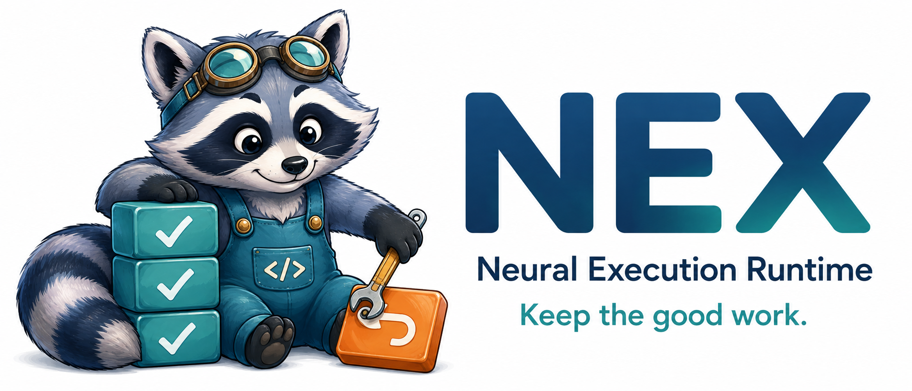

<p align="center">
  
</p>

**让模型大胆预测，让运行时保住正确的工作。**

[English](README.md) · 简体中文

[](LICENSE)

一个模型规则，多次工具调用，一个晚到反例。**为什么已经验证正确的工作也要重做？**

NEX 为小型模型生成程序提供 **semantic retirement 与受限恢复**：模型提供预测和修复，运行时掌握验证、快照、恢复范围与结果发布。

Python 3.10–3.13 · 核心仅依赖标准库 · 默认示例不需要 GPU 或 API key。

## 快速开始

```bash
git clone https://github.com/yangforever17/nex.git
cd nex
python3 -m venv .venv
source .venv/bin/activate         # Windows: .venv\Scripts\activate
python -m pip install -e .

nex demo
nex demo --policy full-retry
nex demo --global-only
```

示例实际写入 16 个私有 JSON 文件：第 7 处使用不同时间单位，局部证据延迟四步到达。

| 策略 | 模型回调 | 失效 site | 文件写入 | 发布次数 |
|---|---:|---:|---:|---:|
| Full Retry | 2 | 11 | 27 | 1 |
| NEX | 2 | 5 | 21 | 1 |
| NEX，仅有全局证据 | 2 | 16 | 32 | 1 |

以上是**确定性示例计数**，不是在线 LLM 加速比。两种策略使用相同的最终验证发布门控。

保留工作区并检查 trace：

```bash
nex demo --output artifacts/first-run
# workspace/           私有 JSON 文件
# trace.jsonl          certificate / exception / resume / publication 事件
# summary.json         操作计数
# publications.sqlite  本地幂等发布 sink
```

输出目录必须不存在。省略 `--output` 时，示例使用自动清理的临时目录。

## 工作方式

```python
def migrate(sites):
    observations = observe(sites[:2])
    rule = semantic(observations, "Migrate timeouts to seconds")
    for site in sites:
        apply_change(site, rule)
    publish_report(sites)
    return final_validate()
```

- **Predict**：从 semantic value 的 fan-out 恢复 obligation，不依赖模型自报。
- **Retire**：sound 局部 validator 支持保留版本；`UNKNOWN` 不等于通过。
- **Recover**：恢复未决窗口，只请求 runtime 授权 site 的修复。
- **Publish**：最终任务验证通过后提交，使用 logical ID 对本地 effect 去重。

## 接入模型和工具

实现 `PredictionProvider.predict / repair` 与 `MigrationAdapter`，或者用 `CallbackProvider` 包装现有模型客户端。没有硬编码模型厂商。

```python
from nex import CallbackProvider, PublicationLedger, Runtime, WorkflowCompiler

# 替换为你的回调、adapter 与 workflow 源码：
provider = CallbackProvider(predict_fn=my_predict, repair_fn=my_repair)
runtime = Runtime(
    WorkflowCompiler().compile(workflow_source),
    adapter=my_adapter,
    provider=provider,
    ledger=PublicationLedger("artifacts/publications.sqlite"),
    publication_id="job-001:report",
)
result = runtime.execute()
assert result.success, result.error
```

完整可运行示例：[examples/run_migration.py](examples/run_migration.py)。
回调签名和 adapter 约束：[接入指南](docs/integration.md)。

## 测试与实验

```bash
python -m pip install -e '.[dev,experiments]'
python -m pytest -q
ruff check .
python examples/run_migration.py

nex benchmark --sizes 8 16 32 64
nex analyze examples/migration.py

# 可选：独立 DAG conformance 与 conservative-envelope 扫描
python -m nex.experiments.conformance --seeds-per-cell 1
python -m nex.experiments.envelopes
```

图扫描是独立的受控实验，不等同于 migration backend 已实现通用 DAG 动态追踪。

## 代码导航

| 模块 | 职责 |
|---|---|
| [compiler.py](src/nex/compiler.py) · [analysis.py](src/nex/analysis.py) | 受限执行语法与 fan-out 分析 |
| [runtime.py](src/nex/runtime.py) | Certificate、快照、恢复和发布门控 |
| [providers.py](src/nex/providers.py) · [ledger.py](src/nex/ledger.py) | 模型回调与本地事务 sink |
| [demo.py](src/nex/demo.py) · [cli.py](src/nex/cli.py) | 可运行示例与受控对比 |
| [experiments/](src/nex/experiments/) · [tests/](tests/) | 独立图检查与回归测试 |

## 适用范围

研究型参考实现，**不是 Python 沙箱**。当前 backend 支持上述有限 workflow 与相互独立的恢复 site，adapter 和回调是可信宿主代码。不提供任意 Python taint、进程崩溃后 continuation 恢复或远端 HTTP exactly-once。SQLite 插入本身是本地 publication，不是对远端请求的原子封装。

[安全说明](SECURITY.md) · [贡献指南](CONTRIBUTING.md) · [Apache-2.0](LICENSE)
